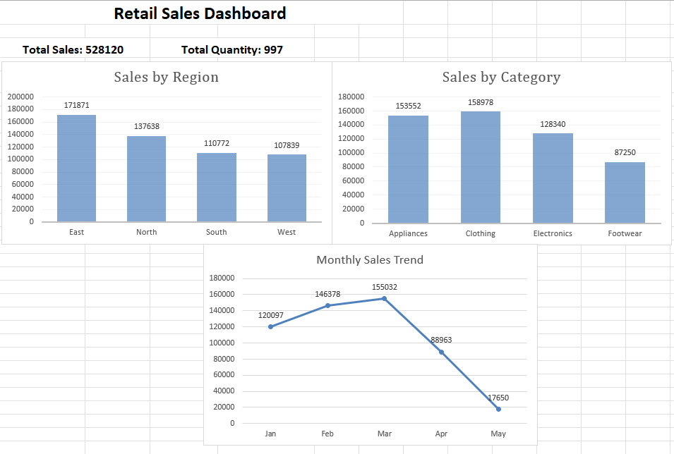

# Retail Sales Dashboard 📊

## 📌 Project Overview
This project is an interactive Excel dashboard analyzing retail sales performance.

## 🛠 Tools Used
- Microsoft Excel
- Pivot Tables
- Charts & Visualization

## 📊 Key Features
- Sales analysis by region
- Category-wise performance
- Monthly sales trend
- KPI metrics (Total Sales & Quantity)

## 🔍 Key Insights
- East region generated highest sales
- Clothing category performed best
- Sales peaked in March and declined afterwards

## 📷 Dashboard Preview
# Retail-Sales-Dashboard
Excel dashboard analyzing sales by region, category, and monthly trends
